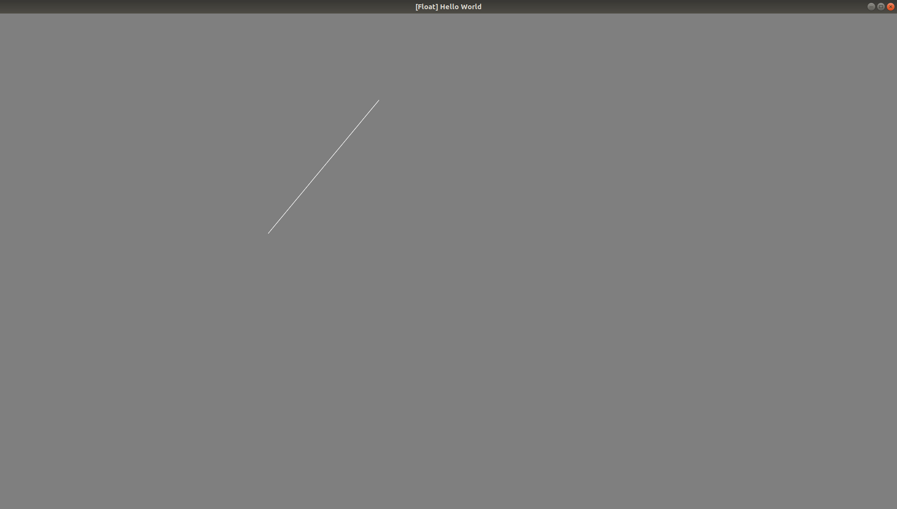
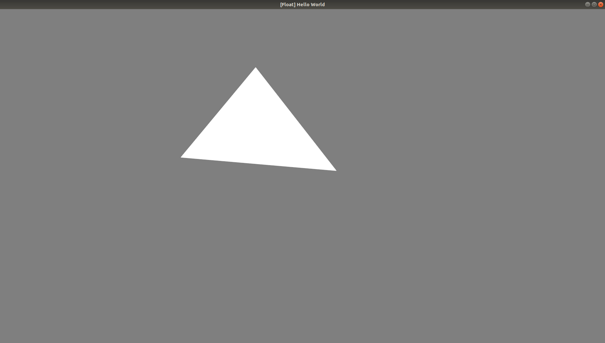
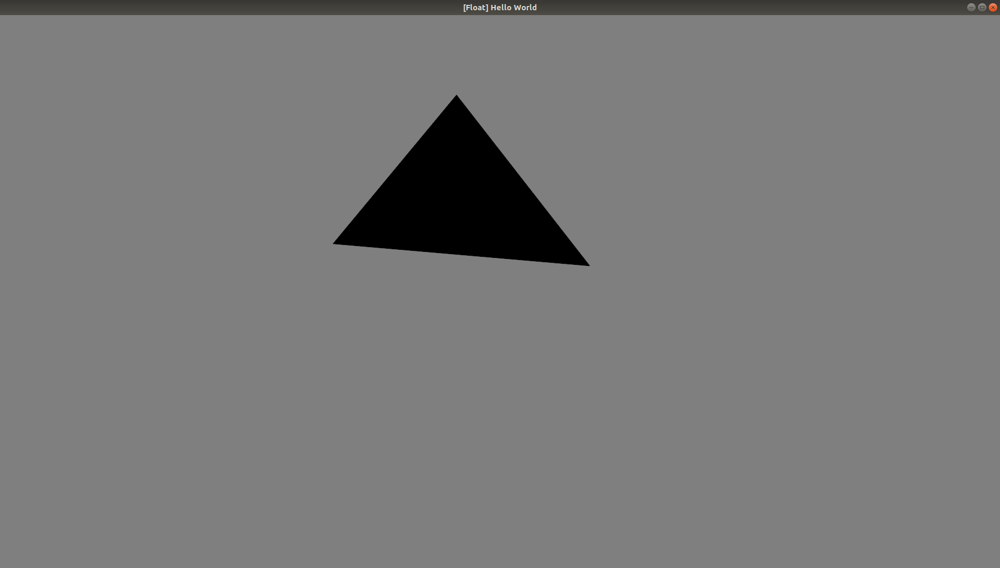
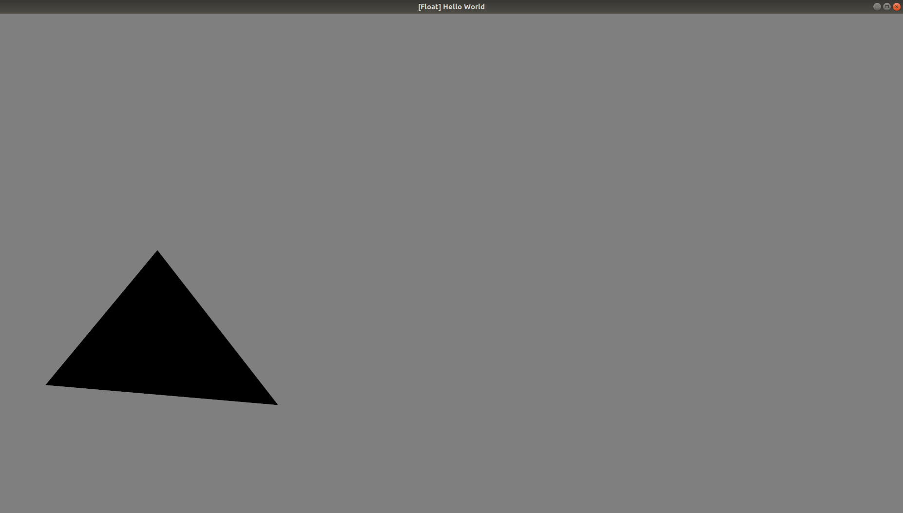
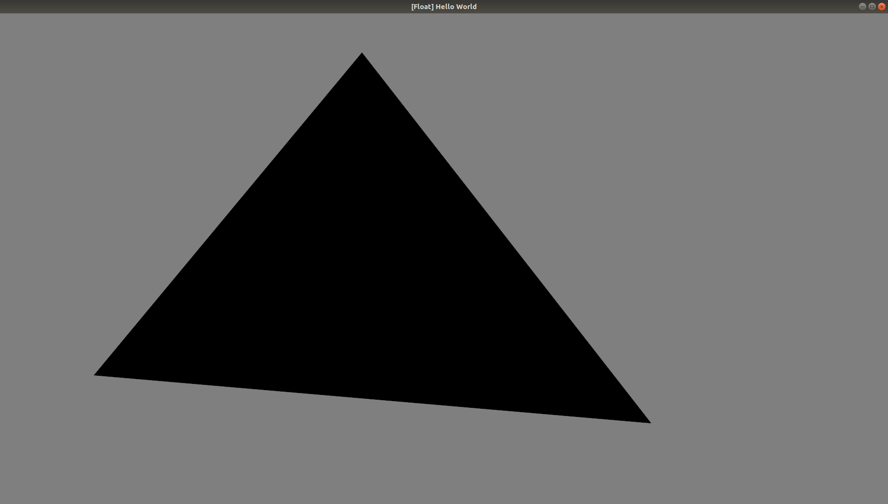
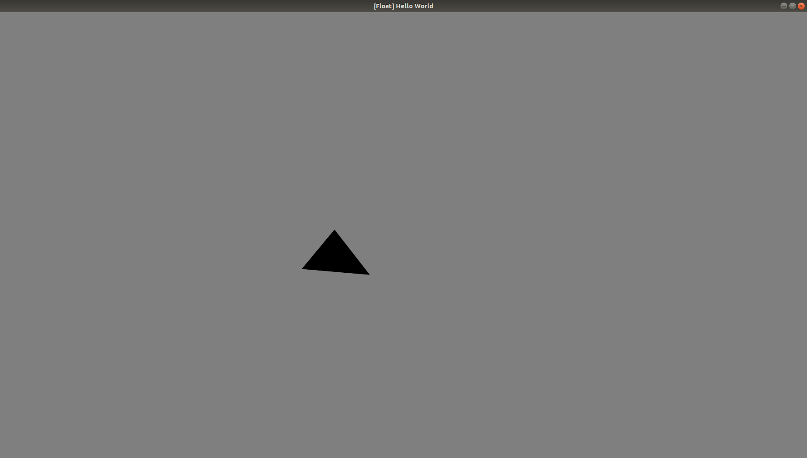
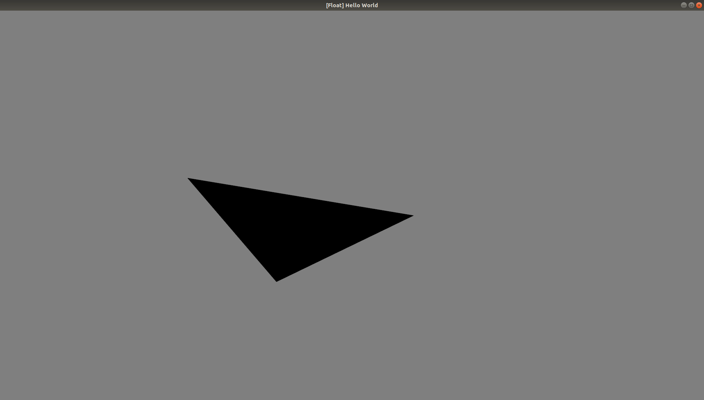
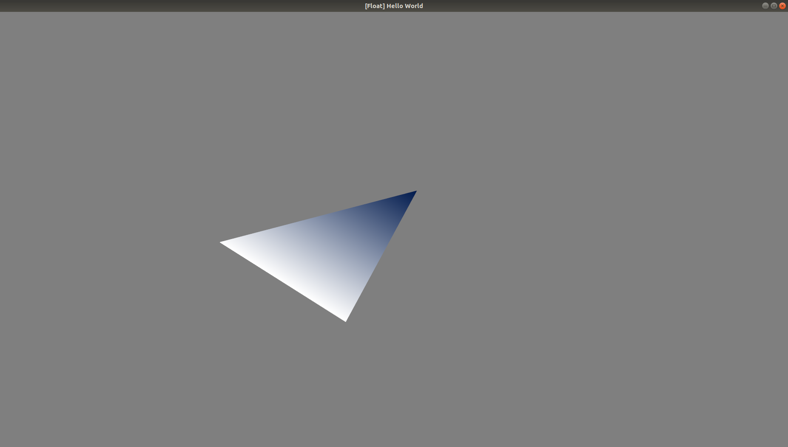
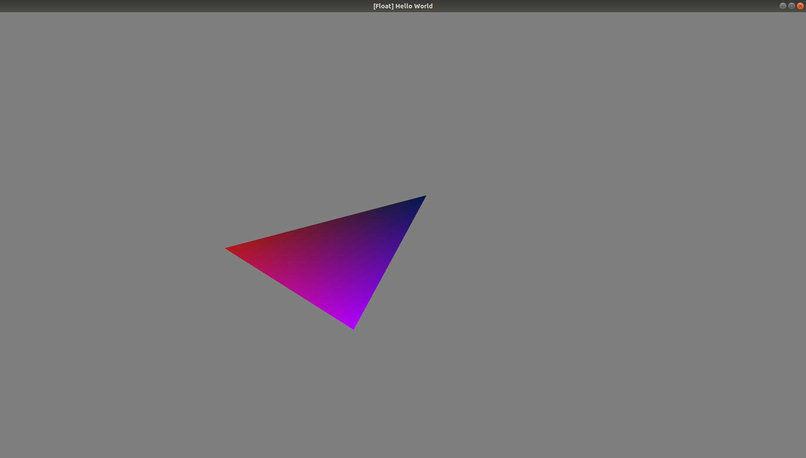
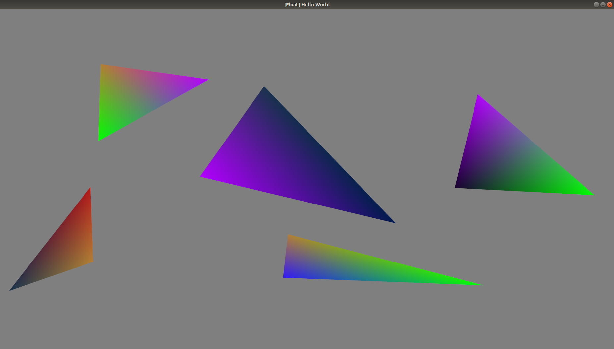

# Assignment 5

By Justin Chen (jc8017)

# Inserting triangle 

Press I to go into insert mode. Then click and a line should follow the mouse. This is the first step in drawing a triangle

 Press the mouse three times and it creates a white triangle

# Selecting Triangle

To select triangle, press O. The triangle should be black

# Move Triangle

In selection mode (Press O), the mouse can click and drag on a triangle to have it moving

# Increase/Decrease triangle size

In the same selection mode, triangles can increase or decrease in size by hitting K and L respectively.

# Rotate triangle 

In the same selection mode, triangles can be rotate clockwise and counterwise with keys H and J respectively.

# Vertex Color

Hit C to enter color mode. Then click anywhere on the screen to choose the closest vertex. Then hit keys 1,2,3,4,5,6,7,8,9 to change the color of closest vertex.

# Misc

Rotatation, size, color, and move is possible with any triangle drawn on the screen

